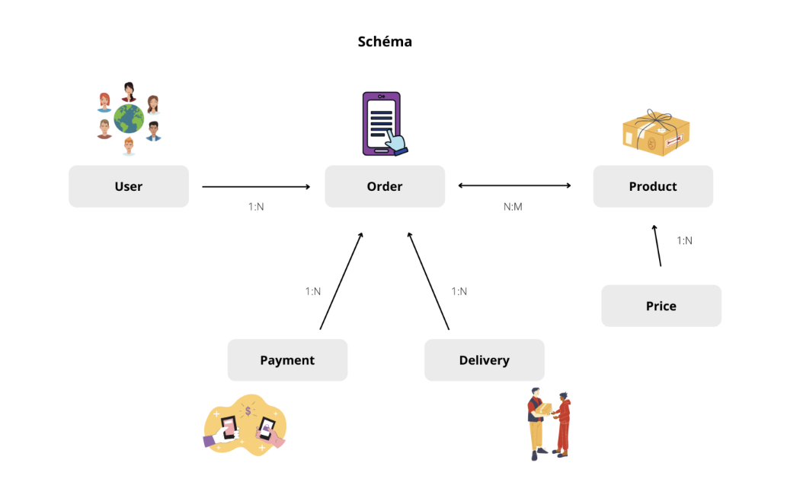

# Cosmetics Store Analytics & SQL Optimization

This project uses a relational SQL database simulating an online cosmetics store. It showcases advanced SQL querying skills and database optimization techniques using real-world scenarios like customer analysis, sales performance, and payment behavior.

## Database Schema

This project is built on top of the following Oracle-style schema:

| Table         | Description |
|---------------|-------------|
| `users`       | Customer personal details |
| `products`    | Product catalog (with metadata) |
| `orders`      | Purchases made by users (one product per order) |
| `prices`      | Product prices (separated for normalization) |
| `payments`    | Payment method and status for each order |
| `delivery`    | Delivery status tracking for each order |

---

